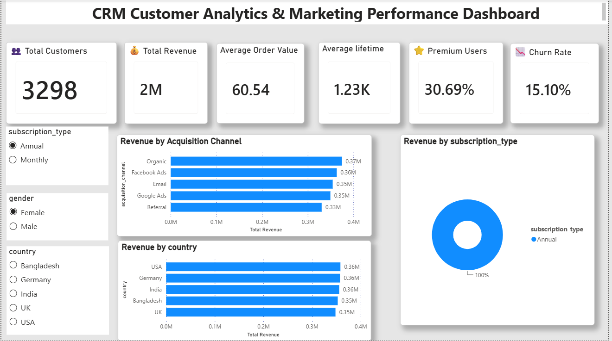
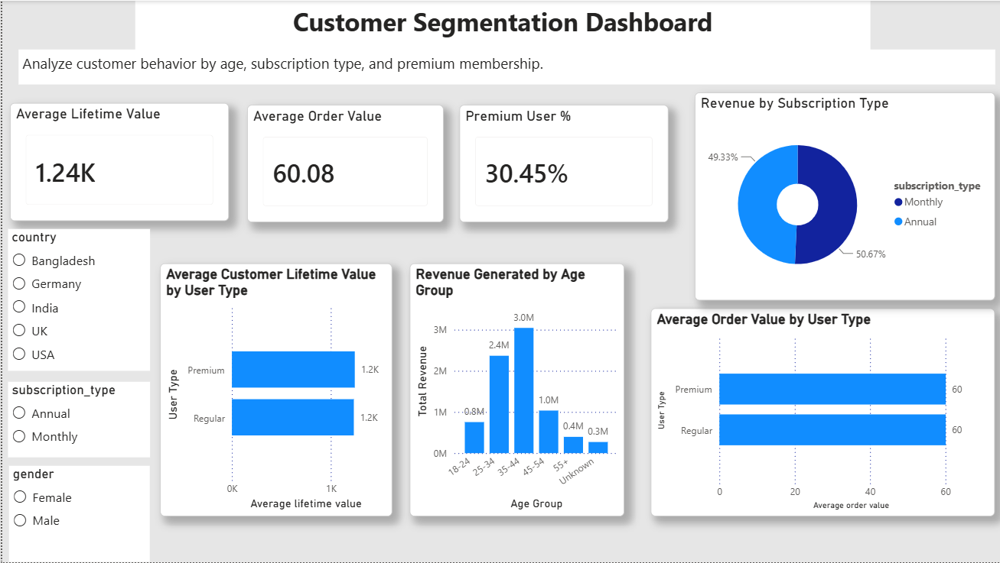
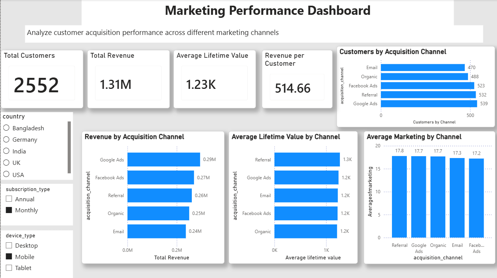
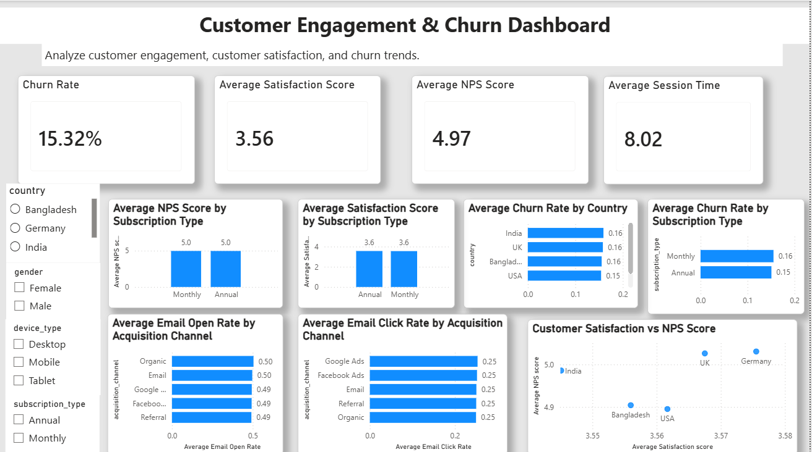

# CRM Customer Analytics & Marketing Performance Dashboard

## 📌 Project Overview

This project analyzes customer behavior, marketing performance, customer engagement, and churn using Power BI. It provides interactive dashboards that help businesses understand customer segments and optimize marketing strategies.

---

## 🛠 Tools Used

- Power BI
- DAX
- Power Query
- Data Modeling
- Data Visualization

---

## 📊 Dashboard Pages

### 1. Executive Summary

---

### 2. Customer Segmentation

---

### 3. Marketing Performance

---

### 4. Customer Engagement & Churn

---

## 📈 Key KPIs

- Total Customers
- Total Revenue
- Average Order Value
- Average Lifetime Value
- Premium User %
- Churn Rate
- Average Satisfaction Score
- Average NPS Score

---

## 💼 Business Questions Answered

- Which age group generates the highest revenue?
- Do premium users spend more than regular users?
- Which subscription type contributes the highest revenue?
- Which acquisition channel brings the most customers?
- Which marketing channel generates the highest revenue?
- Which channel has the highest customer lifetime value?
- Which customer segments have the highest churn?

---

## 📁 Dataset

CRM Customer Analytics Dataset (15,000 records)

---

## 👩‍💻 Developed By

Jamuna Sri